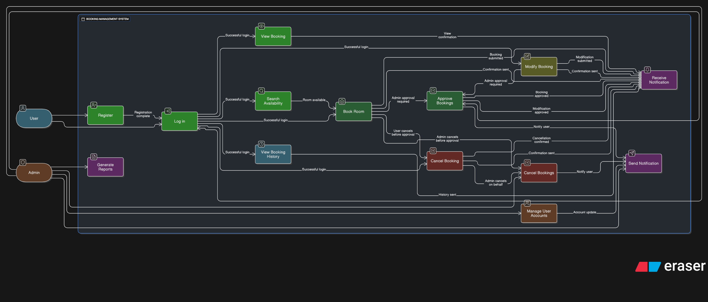

# Requirement Analysis in Software Development

This repository covers key aspects of **Requirement Analysis** in the Software Development Life Cycle (SDLC). It includes definitions, importance, activities, types of requirements, diagrams, and criteria for validating user needs in a software system.

---

## What is Requirement Analysis?

Requirement Analysis is the process of identifying, gathering, and analyzing the needs or conditions to meet for a new or modified product or project. It is a **critical early phase** in the SDLC that helps ensure the project aligns with business objectives and user expectations.

This phase involves:
- Interacting with stakeholders to understand their needs.
- Documenting what the system must do.
- Resolving conflicting requirements.
- Preparing the foundation for design, development, and testing.

Requirement Analysis bridges the gap between what the user wants and how developers will build it.

---

## Why is Requirement Analysis Important?

Requirement Analysis is vital for multiple reasons:

- ✅ **Avoids Miscommunication**  
  Clarifies expectations between stakeholders and developers.

- ✅ **Reduces Cost and Time**  
  Early identification of errors and clear requirements avoid costly changes later.

- ✅ **Improves Quality**  
  Well-defined requirements ensure the software meets user needs effectively.

---

## Key Activities in Requirement Analysis

- 🔍 **Requirement Gathering**  
  Collecting information from stakeholders through interviews, surveys, and observations.

- 🧠 **Requirement Elicitation**  
  Extracting hidden or unstated needs using techniques like brainstorming, prototyping, and workshops.

- 📝 **Requirement Documentation**  
  Writing clear, structured requirement specifications (SRS).

- 📊 **Requirement Analysis and Modeling**  
  Analyzing feasibility, prioritization, and dependencies; often visualized via models like use case diagrams.

- ✅ **Requirement Validation**  
  Ensuring requirements are complete, consistent, and agreed upon by all parties.

---

## Types of Requirements

### Functional Requirements

These define **what the system should do**—the core features and interactions.

**Examples for Booking Management System:**
- Users can create and manage bookings.
- Admin can approve or cancel reservations.
- System sends confirmation emails after booking.

### Non-functional Requirements

These describe **how the system performs** rather than what it does.

**Examples for Booking Management System:**
- The system must support 10,000 concurrent users.
- Response time must be less than 2 seconds.
- Data should be encrypted in transit and at rest.

---

## Use Case Diagrams

Use Case Diagrams visually represent the system’s functionality and the actors interacting with it.

### Benefits:
- Improve stakeholder understanding.
- Provide clarity during design.
- Identify functional boundaries.

### Diagram for Booking Management System:

> *(Image: `alx-booking-uc.png` should be created in Draw.io or Lucidchart and uploaded to the repo.)*

Actors:
- **User**
- **Admin**

Use Cases:
- Register
- Log in
- Search availability
- Book room
- View booking
- Cancel booking
- Approve/cancel bookings (Admin)

---

## Acceptance Criteria

**Acceptance Criteria** are pre-defined standards or conditions a feature must meet to be accepted by stakeholders.

### Why They Matter:
- Set clear expectations for features.
- Guide development and testing.
- Ensure alignment with business goals.

### Example – *Checkout Feature* in Booking System:

**Acceptance Criteria:**
- User must be logged in to complete checkout.
- Payment must be processed using a secure gateway.
- A confirmation message should be displayed after successful booking.
- Booking data must be saved to the database.
- A confirmation email is sent to the user within 5 minutes.

---
